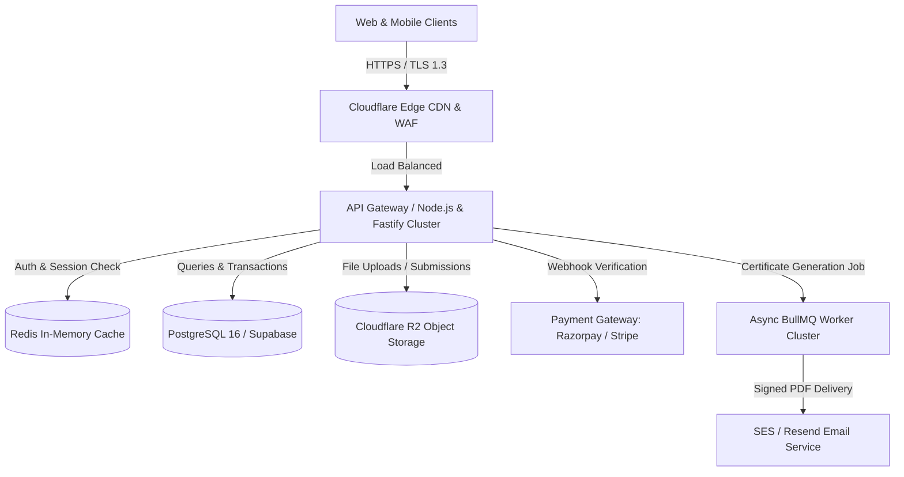
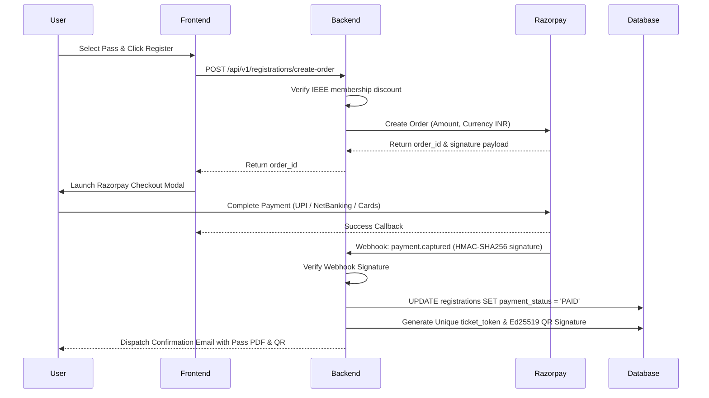

# Dhyuthi 7.0 — Proposed Backend Architecture & System Design

## 1. System Overview & Architecture

While the frontend operates autonomously as a zero-dependency static application, this document details the proposed production-grade backend system designed to handle:
- High-concurrency attendee registration spikes during ticket drops.
- Payment gateway reconciliation (Razorpay / Stripe).
- Pre-event team submissions and file storage.
- Cryptographically verified KTU activity point certificate generation.

### System Topology Diagram



---

## 2. Database Schema (PostgreSQL DDL)

### 2.1 Core Relational Schema

```sql
-- 1. Users & Authentication
CREATE TABLE users (
    id UUID PRIMARY KEY DEFAULT gen_random_uuid(),
    full_name VARCHAR(120) NOT NULL,
    email VARCHAR(255) UNIQUE NOT NULL,
    phone VARCHAR(20) NOT NULL,
    college VARCHAR(255) NOT NULL,
    ktu_reg_no VARCHAR(50),
    year_of_study SMALLINT CHECK (year_of_study BETWEEN 1 AND 5),
    is_ieee_member BOOLEAN DEFAULT FALSE,
    ieee_member_id VARCHAR(50),
    created_at TIMESTAMPTZ DEFAULT CURRENT_TIMESTAMP,
    updated_at TIMESTAMPTZ DEFAULT CURRENT_TIMESTAMP
);

-- 2. Passes & Ticket Tiers
CREATE TABLE ticket_tiers (
    id VARCHAR(50) PRIMARY KEY, -- 'pass-all-access', 'pass-single-track', etc.
    tier_name VARCHAR(100) NOT NULL,
    base_price_inr NUMERIC(10, 2) NOT NULL,
    ieee_discounted_price_inr NUMERIC(10, 2) NOT NULL,
    max_capacity INTEGER NOT NULL,
    sold_count INTEGER DEFAULT 0,
    is_active BOOLEAN DEFAULT TRUE
);

-- 3. Festival Tracks
CREATE TABLE tracks (
    id VARCHAR(50) PRIMARY KEY, -- 'aigenix', 'cellestro', 'incepta', 'synkron'
    name VARCHAR(100) NOT NULL,
    sub_title VARCHAR(255),
    lead_coordinator VARCHAR(100),
    max_seats INTEGER NOT NULL,
    allocated_seats INTEGER DEFAULT 0
);

-- 4. Registrations & Payments
CREATE TABLE registrations (
    id UUID PRIMARY KEY DEFAULT gen_random_uuid(),
    user_id UUID REFERENCES users(id) ON DELETE CASCADE,
    ticket_tier_id VARCHAR(50) REFERENCES ticket_tiers(id),
    selected_track_id VARCHAR(50) REFERENCES tracks(id),
    ticket_token VARCHAR(30) UNIQUE NOT NULL, -- e.g. 'DHY7-PASS-X92F'
    amount_paid NUMERIC(10, 2) NOT NULL,
    payment_status VARCHAR(20) DEFAULT 'PENDING' CHECK (payment_status IN ('PENDING', 'PAID', 'FAILED', 'REFUNDED')),
    payment_gateway_ref VARCHAR(100),
    qr_signature TEXT NOT NULL,
    checked_in BOOLEAN DEFAULT FALSE,
    checked_in_at TIMESTAMPTZ,
    created_at TIMESTAMPTZ DEFAULT CURRENT_TIMESTAMP
);

-- 5. Pre-Events & Team Registrations
CREATE TABLE pre_events (
    id VARCHAR(50) PRIMARY KEY, -- 'trail-quest', 'doodle-quest', 'strikezone', etc.
    title VARCHAR(120) NOT NULL,
    max_team_size SMALLINT NOT NULL,
    min_team_size SMALLINT NOT NULL DEFAULT 1,
    prize_pool_inr NUMERIC(10, 2) NOT NULL,
    registration_deadline TIMESTAMPTZ NOT NULL
);

CREATE TABLE pre_event_teams (
    id UUID PRIMARY KEY DEFAULT gen_random_uuid(),
    pre_event_id VARCHAR(50) REFERENCES pre_events(id),
    team_name VARCHAR(100) NOT NULL,
    leader_user_id UUID REFERENCES users(id),
    submission_url TEXT,
    created_at TIMESTAMPTZ DEFAULT CURRENT_TIMESTAMP
);

CREATE TABLE pre_event_members (
    id UUID PRIMARY KEY DEFAULT gen_random_uuid(),
    team_id UUID REFERENCES pre_event_teams(id) ON DELETE CASCADE,
    user_id UUID REFERENCES users(id),
    UNIQUE (team_id, user_id)
);

-- 6. Verified KTU Activity Point Certificates
CREATE TABLE certificates (
    id UUID PRIMARY KEY DEFAULT gen_random_uuid(),
    user_id UUID REFERENCES users(id),
    registration_id UUID REFERENCES registrations(id),
    event_type VARCHAR(50) NOT NULL, -- 'WORKSHOP', 'HACKATHON', 'PRE_EVENT'
    track_name VARCHAR(100) NOT NULL,
    ktu_points_awarded SMALLINT DEFAULT 30,
    certificate_hash VARCHAR(64) UNIQUE NOT NULL, -- SHA-256 digital signature
    pdf_storage_url TEXT NOT NULL,
    issued_at TIMESTAMPTZ DEFAULT CURRENT_TIMESTAMP
);

CREATE INDEX idx_reg_token ON registrations(ticket_token);
CREATE INDEX idx_cert_hash ON certificates(certificate_hash);
```

---

## 3. Authentication & Authorization Flow

1. **Attendee Access**: Passwordless Magic Link / Google OAuth2.
2. **IEEE SCT SB Admin / Coordinator Access**:
   - Role-Based Access Control (RBAC): `SuperAdmin`, `TrackLead`, `VolunteerScanner`.
   - Volunteer scanners access a dedicated mobile scanner PWA that validates attendee `qr_signature` at the registration desk.
3. **Session Tokens**: JWT (JSON Web Tokens) signed with Ed25519 asymmetric keys, 15-minute expiration, backed by rotating Redis refresh tokens.

---

## 4. Payment Lifecycle & Webhook Reconciliation



---

## 5. KTU Certificate Cryptographic Verification

A common vulnerability in university symposiums is certificate tampering or forged KTU point documentation. Dhyuthi 7.0 incorporates a **tamper-evident verification engine**:
1. When attendance is confirmed on Day 3, the backend computes:
   $$\text{Hash} = \text{HMAC-SHA256}(\text{RegNo} + \text{EventName} + \text{Points} + \text{SecretKey})$$
2. A vector QR code encoding `https://dhyuthi.ieeesctsb.org/verify/{certificate_hash}` is embedded directly onto the PDF certificate.
3. KTU university auditors can scan any physical or digital certificate to instantly verify its authenticity directly against the backend database without needing login credentials.

---

## 6. Deployment & Security Posture

- **DDoS & Bot Protection**: Cloudflare Enterprise WAF with Under Attack mode for registration launches.
- **Rate Limiting**: Redis Token Bucket algorithm capping registration attempts to 5 requests/minute per IP.
- **Data Compliance**: Adherence to the Digital Personal Data Protection (DPDP) Act. All phone numbers and student identifiers encrypted at rest using AES-256.
